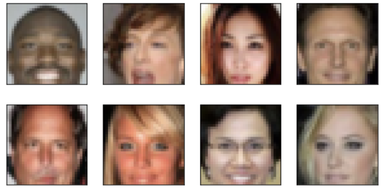
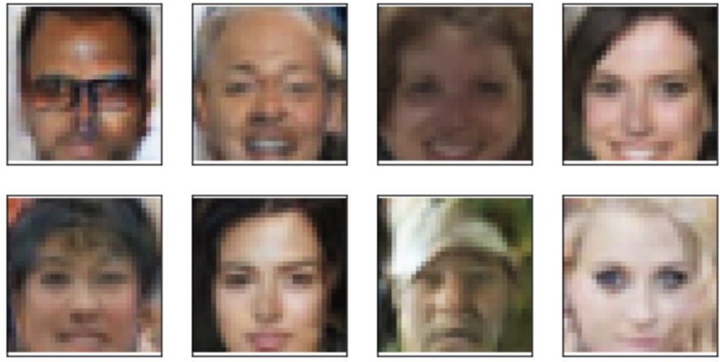

# face-generation
Udacity's Face Generation project implementation with PyTorch

**Udacity's original repo is [here](https://github.com/udacity/deep-learning-v2-pytorch/tree/master/project-face-generation)**

## Project Overview

This project defines and trains a DCGAN on a dataset of faces. The goal is to get a generator network to generate new images of faces that look as realistic as possible!

## Dataset

* We'll be using the [CelebFaces Attributes Dataset (CelebA)](http://mmlab.ie.cuhk.edu.hk/projects/CelebA.html) to train your adversarial networks.

## DCGAN Structure

Discriminator(  
  (conv1): Sequential(  
    (0): Conv2d(3, 64, kernel_size=(4, 4), stride=(2, 2), padding=(1, 1), bias=False)  
  )  
  (conv2): Sequential(  
    (0): Conv2d(64, 128, kernel_size=(4, 4), stride=(2, 2), padding=(1, 1), bias=False)  
    (1): BatchNorm2d(128, eps=1e-05, momentum=0.1, affine=True, track_running_stats=True)  
  )  
  (conv3): Sequential(  
    (0): Conv2d(128, 256, kernel_size=(4, 4), stride=(2, 2), padding=(1, 1), bias=False)  
    (1): BatchNorm2d(256, eps=1e-05, momentum=0.1, affine=True, track_running_stats=True)  
  )  
  (conv4): Sequential(  
    (0): Conv2d(256, 512, kernel_size=(4, 4), stride=(2, 2), padding=(1, 1), bias=False)  
    (1): BatchNorm2d(512, eps=1e-05, momentum=0.1, affine=True, track_running_stats=True)  
  )  
  (fc1): Linear(in_features=2048, out_features=1, bias=True)  
)  

Generator(  
  (fc): Linear(in_features=100, out_features=2048, bias=True)  
  (t_conv1): Sequential(  
    (0): ConvTranspose2d(512, 256, kernel_size=(4, 4), stride=(2, 2), padding=(1, 1), bias=False)   
    (1): BatchNorm2d(256, eps=1e-05, momentum=0.1, affine=True, track_running_stats=True)  
  )  
  (t_conv2): Sequential(  
    (0): ConvTranspose2d(256, 128, kernel_size=(4, 4), stride=(2, 2), padding=(1, 1), bias=False)  
    (1): BatchNorm2d(128, eps=1e-05, momentum=0.1, affine=True, track_running_stats=True)  
  )  
  (t_conv3): Sequential(  
    (0): ConvTranspose2d(128, 64, kernel_size=(4, 4), stride=(2, 2), padding=(1, 1), bias=False)  
    (1): BatchNorm2d(64, eps=1e-05, momentum=0.1, affine=True, track_running_stats=True)  
  )  
  (t_conv4): Sequential(  
    (0): ConvTranspose2d(64, 3, kernel_size=(4, 4), stride=(2, 2), padding=(1, 1), bias=False)  
  )  
)  

## Sample Input Image

## Generated output Image

